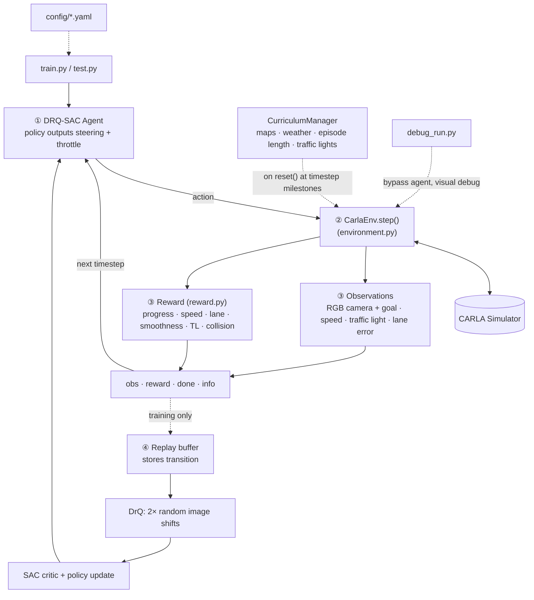

# DRQ-SAC: Learning Autonomous Driving in the CARLA Simulator Using Reinforcement Learning

[](https://www.python.org/)
[](https://carla.org/)
[](LICENSE)

A complete end-to-end reinforcement learning project that trains an agent to drive autonomously in the [CARLA simulator](https://carla.org/). The agent learns to navigate from random spawn points to random destinations across multiple maps while handling lane keeping, speed compliance, route following, and traffic light rules — all from raw camera images + simple vector observations.

---

## Overview

Traditional autonomous driving systems rely on modular pipelines (perception → planning → control) with hand-engineered rules. These often struggle with edge cases and unpredictable environments.

This project takes a different approach: **end-to-end learning** using **Reinforcement Learning (RL)**. An agent interacts directly with the CARLA simulator and learns optimal driving behavior purely through trial and error, guided by a carefully designed reward signal.

**Core algorithm**: [Soft Actor-Critic (SAC)](https://arxiv.org/abs/1801.01290) enhanced with **DrQ-v1** image augmentation for visual robustness.

The project demonstrates how techniques like **dense reward shaping** and **curriculum learning** can solve the sparse-reward problem inherent in long-horizon driving tasks.

---

## Key Features

- **Custom Gymnasium environment** fully compatible with Stable-Baselines3
- **Multi-modal observations**: RGB camera (84×84) + normalized vector features (goal direction, traffic light state, speed, lane error, etc.)
- **Continuous action space**: Steering + throttle/brake
- **Dense multi-component reward function** with configurable weights
- **Curriculum learning**: Progressive increase in difficulty (maps, weather, episode length, traffic lights)
- **DrQ-v1 augmentation**: Random shift augmentation on camera images during training for weather/lighting robustness
- **Robust traffic light detection and compliance** logic
- **Resumable training** with automatic checkpointing
- **Powerful debugging tools**: Detailed per-step logging + visual debug script with spectator camera and waypoint visualization
- **Fully configurable** via YAML files (no code changes needed for most experiments)

---

## Project Architecture & How Everything Interacts

The system is designed to be modular and clean. The diagram below shows one full RL step — the agent and environment loop continuously until an episode ends, then `reset()` starts a new one.



### Detailed Component Interaction

1. **CarlaEnv** is the central piece. It owns the CARLA client, world, vehicle, sensors, route planner, and traffic-light tracking logic.
  
2. Every `step()`:
  
  - Converts agent action → `carla.VehicleControl`
  - Ticks the simulator
  - Updates internal state (route progress, current traffic light, lane metrics)
  - Builds the observation dictionary
  - Calls the reward function (if provided) to get scalar reward + component breakdown
  - Checks termination conditions (collision, red light violation, destination reached, waypoint timeout)
3. **Curriculum** is applied inside `reset()` and at the start of training. The environment checks the current global timestep and applies pending changes (new map pool, weather presets, longer episodes, enabling traffic lights).
  
4. **DrQ Augmentation** only affects training:
  
  - The custom replay buffer returns two randomly shifted versions of the camera image.
  - The custom SAC agent trains the critics on both augmented views.
  - This forces the policy to learn features that are invariant to small shifts (improves robustness to rain, fog, lighting changes).
5. **Reward Function** is deliberately decoupled. It receives a rich state dictionary from the environment and returns both a scalar and a detailed breakdown (very useful for debugging reward balance).
  
6. **Debugging tools** (`debug_run.py`) bypass the agent entirely. They let you visualize exactly what the agent sees (goal vector, tracked traffic light, waypoints) and inspect reward components in real time.
  

---

## Installation

### Prerequisites

- **CARLA 0.9.16** (server must be running)
- Python 3.12
- NVIDIA GPU recommended (training can take 50–100+ hours depending on timesteps and whether camera is enabled)

### Setup

```bash
# Clone the repository
git clone https://github.com/RoanKnight/Carla-RL-Pytorch.git
cd Carla-RL-Pytorch

# Install dependencies (using uv recommended)
uv sync
# or
pip install -e .
```

Make sure your CARLA server is running on the default port (`localhost:2000`).

---

## Configuration

All important settings live in YAML files under `config/`:

- `base.yaml` — Base environment and observation settings
- `training.yaml` — SAC hyperparameters, reward weights, curriculum schedule, DrQ settings, map/weather pools

You can change almost everything (reward weights, which maps/weather to use, when traffic lights turn on, DrQ shift amount, etc.) without touching Python code.

Example curriculum snippet (conceptual):

```yaml
curriculum:
  phase_changes:
    - timestep: 500_000
      maps: [Town01, Town02, Town03]
      weathers: [ClearNoon, CloudyNoon, ...]
      traffic_lights: true
```

---

## Usage

### Training

```bash
python train.py
```

- Automatically resumes from the latest checkpoint if one exists.
- Uses settings from `config/training.yaml`.
- Supports both plain SAC and DRQ-SAC (controlled via config).

### Evaluation / Testing

```bash
python test.py --checkpoint path/to/checkpoint.zip --episodes 10
```

Runs the trained agent in evaluation mode (no exploration noise, DrQ disabled).

### Debugging & Visualization

```bash
python debug_run.py --map Town01 --weather ClearNoon
```

Launches a visual debugging session with:

- Spectator camera following the vehicle
- On-screen visualization of waypoints and route
- Detailed console logging of observations, traffic light state, reward components, etc.

This tool was invaluable during development for verifying that the agent receives correct information.

---

## How the Main Aspects Work

### 1. CarlaEnv (`environment.py`)

The heart of the project. It implements the full Gymnasium interface (`reset`, `step`, `close`) while hiding all CARLA complexity.

Key internal systems:

- Route planning using CARLA’s `GlobalRoutePlanner`
- Waypoint progression tracking with timeout protection
- Sophisticated traffic-light detection that stays on the planned route (with hysteresis to avoid flickering)
- Camera and collision sensor management
- Curriculum-aware map and weather randomization

### 2. Reward Function (`reward.py`)

A dense, multi-component reward designed to give the agent frequent, informative feedback:

- **Waypoint progress** — encourages moving toward the destination
- **Speed compliance** — penalizes deviation from target speed (target speed dynamically lowers near red lights)
- **Lane deviation** — keeps the vehicle near the route centerline
- **Smoothness** — penalizes jerky steering and throttle changes
- **Collision & traffic light violation** — large negative penalties
- **Holding at red light** — positive reward for correct stopping behavior
- **Success bonus** — one-time reward for reaching the destination

All weights are tunable in the YAML file.

### 3. Curriculum Learning

Instead of throwing the agent into the hardest possible scenario immediately, difficulty increases gradually:

- Early training: few simple maps, clear weather, short episodes, **no traffic lights**
- Later training: more maps, bad weather (rain/fog), longer episodes, traffic lights enabled

This lets the agent first master basic skills (lane keeping, route following) before tackling intersections and reduced visibility.

### 4. DrQ Augmentation

Camera images are randomly shifted during training. The agent sees two different crops of the same scene in each batch. This technique (from the DrQ paper) significantly improves robustness to visual changes caused by weather and lighting.

---

## Observation & Action Spaces

**Observation** (`spaces.Dict`):

- `image` (optional): `(84, 84, 3)` RGB
- `goal`: 2D normalized vector toward next waypoint
- `traffic_light_state`, `distance_to_stop`
- `speed`, `target_speed`, `speed_error`
- `signed_lane_error`
- `last_action`

**Action**:

- Continuous `[-1, 1]` for steering
- Continuous `[-1, 1]` for throttle/brake (negative = brake)

---

## Results

The trained agents (both with and without camera + DrQ) demonstrate:

- Reliable lane keeping and route following
- Appropriate speed control
- Correct stopping behavior at red and yellow traffic lights

Training was performed on an RTX 4070 laptop GPU. Full curriculum runs with the camera enabled can take over 100 hours.

---